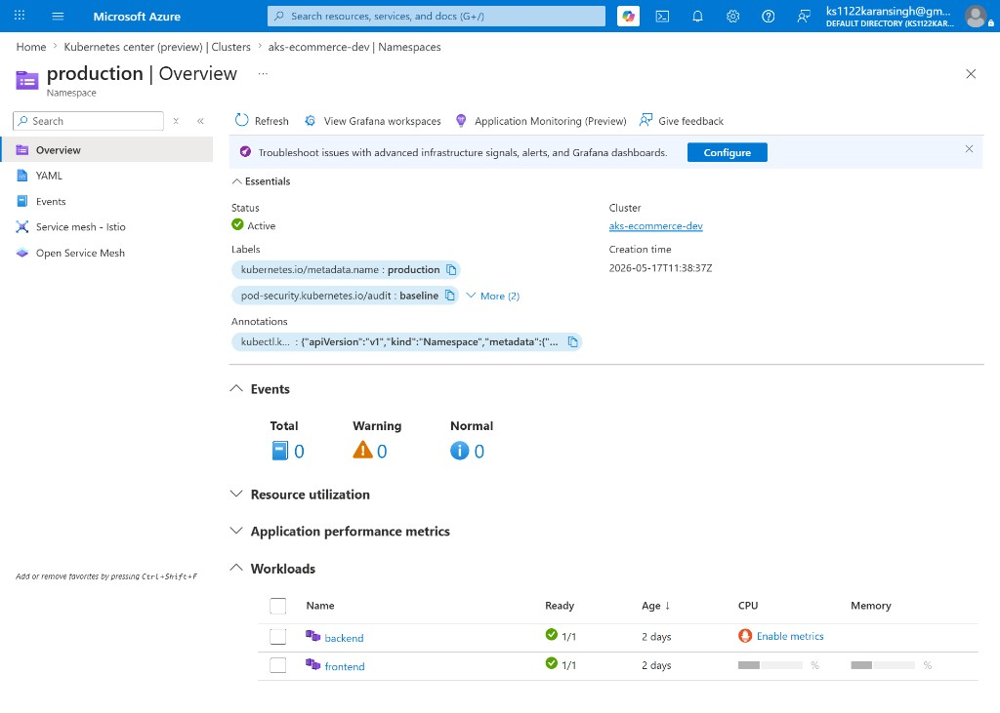
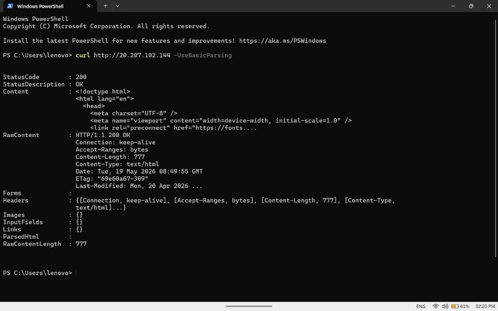
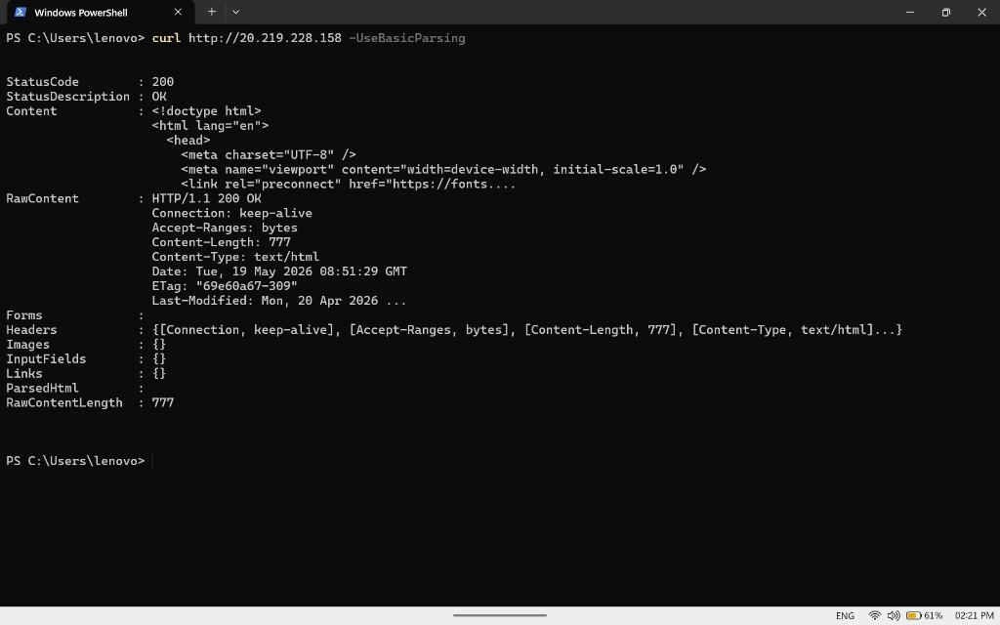
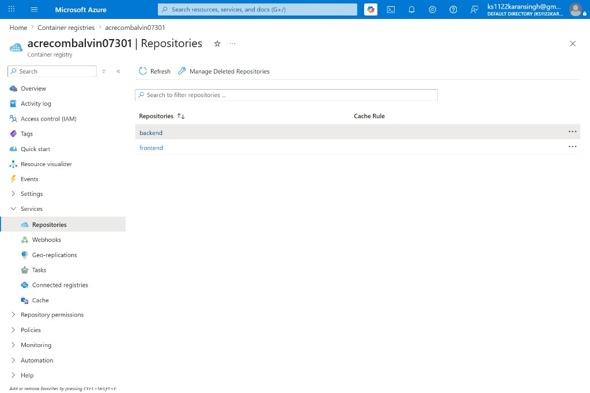
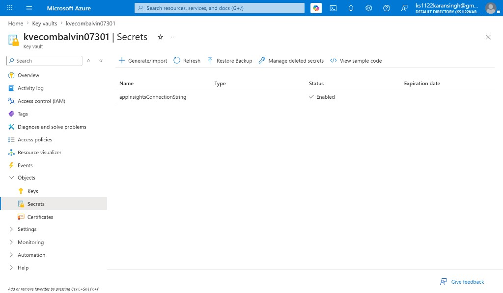
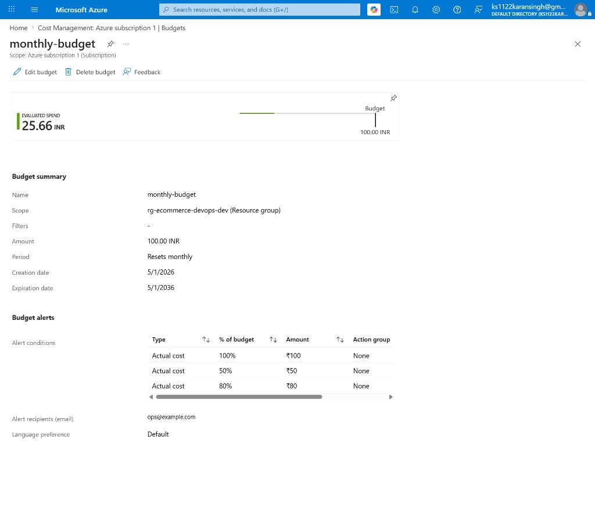
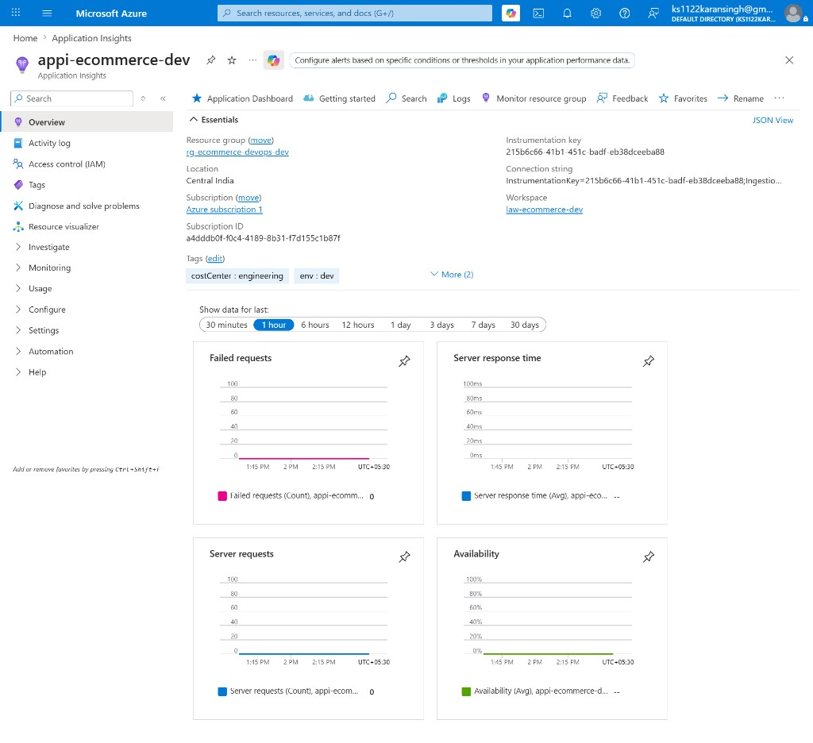
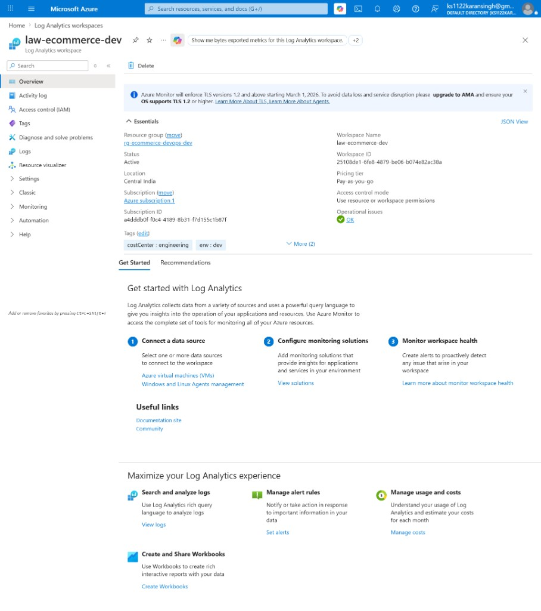

# E-Commerce CI/CD Capstone Project Report

## 1) Project Overview

This capstone implements an end-to-end DevOps lifecycle for a modular e-commerce platform on Azure.

- `frontend`: React + Vite SPA
- `backend`: Node.js + Express API
- Shared product catalog: `shared/catalog.json`

Objective coverage:

- Source control workflow (GitHub)
- CI/CD definitions (Azure DevOps + optional Jenkins)
- Docker containerization
- Infrastructure as Code via Terraform
- AKS orchestration
- Key Vault-based secret management
- Monitoring and cost governance integration

---

## 2) Implemented Architecture

- Source repository: GitHub
- CI/CD definitions:
  - `azure-pipelines.yml` (CI entry)
  - `azure-pipelines-cd.yml` (CD entry)
  - `pipelines/ci.yml`, `pipelines/cd.yml`
  - `Jenkinsfile` (alternative path)
- Container registry: Azure Container Registry (ACR)
- Compute/orchestration: Azure Kubernetes Service (AKS)
- Secrets: Azure Key Vault + Secrets Store CSI Driver
- Observability: Log Analytics + Application Insights
- Governance: Azure budget + alert action group
- IaC: Terraform module under `infra/terraform/`

Deployed environment details (dev subscription):

- Resource Group: `rg-ecommerce-devops-dev`
- AKS Cluster: `aks-ecommerce-dev`
- ACR: `acrecombalvin07301.azurecr.io`
- Key Vault: `kvecombalvin07301`
- Region: `centralindia`

---

## 3) Phase-wise Completion Status

### Phase 1: Planning and Design

- Architecture draft exists (`docs/architecture.drawio`).
- Cost-estimation section prepared in this report.
- Pending submission artifact: exported diagram PNG/PDF screenshot.

### Phase 2: Source Control and Git Workflow

- Repository hosted on GitHub.
- Branching strategy and PR template/checklist docs present.
- Pending evidence: branch protection screenshots from GitHub settings.

### Phase 3: CI Pipeline

- Azure DevOps YAML files are implemented in repo.
- Pipeline stages include lint/test/build/artifacts/image steps.
- Pending evidence: successful CI run URL/screenshots.

### Phase 4: Dockerization and Image Management

- `frontend/Dockerfile` and `backend/Dockerfile` completed.
- `docker-compose.yml` supports local run.
- Images built and pushed:
  - `acrecombalvin07301.azurecr.io/frontend:latest`
  - `acrecombalvin07301.azurecr.io/backend:latest`

### Phase 5: CD and AKS Deployment

- Namespaces and manifests deployed for staging + production.
- Staging and production workloads validated as running.
- Frontend endpoint health check returned HTTP 200:
  - Staging LB IP: `20.207.102.144`
  - Production LB IP: `20.219.228.158`

### Phase 6: IaC (Terraform)

- Terraform successfully provisioned and manages:
  - Resource Group
  - VNet/Subnet/NSG
  - AKS
  - ACR
  - Key Vault
  - Log Analytics
  - Application Insights
  - Budget + Activity Log alert action group

### Phase 7: Security Integration

- Key Vault RBAC and secret consumption via CSI are working.
- Role assignments validated for AKS pull and Key Vault secret read.
- Network policy for backend ingress applied.
- CI contains Trivy scanning definition.

### Phase 8: Monitoring and Cost

- Infrastructure for observability is provisioned.
- Budget resource created via Terraform.
- Pending evidence: Azure Monitor and Cost Management dashboard screenshots.

---

## 4) Technical Execution Summary

### 4.1 Infra Provisioning

Executed from:

```bash
cd infra/terraform/envs/dev
terraform init
terraform plan -out=tfplan
terraform apply tfplan
```

Notable runtime fixes completed:

- OIDC/workload identity aligned in AKS config.
- Key Vault RBAC permission path fixed for secret creation and CSI reads.
- AKS VM size/quota-compatible adjustments.

### 4.2 Container Build and Push

```bash
docker build -f frontend/Dockerfile -t acrecombalvin07301.azurecr.io/frontend:latest .
docker push acrecombalvin07301.azurecr.io/frontend:latest

docker build -f backend/Dockerfile -t acrecombalvin07301.azurecr.io/backend:latest .
docker push acrecombalvin07301.azurecr.io/backend:latest
```

### 4.3 AKS Runtime Validation

Commands used for verification:

```bash
kubectl get pods -n staging
kubectl get pods -n production
kubectl get svc,ingress -n staging
kubectl get svc,ingress -n production
```

Validation result:

- Staging: backend and frontend running
- Production: backend and frontend running
- External frontend access returns `200 OK` on both environments

---

## 5) Required Snippets

### 5.1 Frontend Dockerfile (actual pattern)

```dockerfile
FROM node:20-alpine AS build
WORKDIR /build
COPY shared /build/shared
COPY frontend/package*.json /build/frontend/
WORKDIR /build/frontend
RUN npm ci
COPY frontend .
RUN npm run build

FROM nginx:1.27-alpine
COPY frontend/nginx.conf /etc/nginx/conf.d/default.conf
COPY --from=build /build/frontend/dist /usr/share/nginx/html
EXPOSE 80
```

### 5.2 Azure DevOps CI Snippet

```yaml
trigger:
  branches:
    include:
      - develop
      - main
```

### 5.3 Terraform Snippet (AKS + ACR)

```hcl
resource "azurerm_container_registry" "acr" {
  name                = var.acr_name
  resource_group_name = azurerm_resource_group.rg.name
  location            = azurerm_resource_group.rg.location
  sku                 = "Basic"
}

resource "azurerm_kubernetes_cluster" "aks" {
  name                      = var.aks_name
  resource_group_name       = azurerm_resource_group.rg.name
  location                  = azurerm_resource_group.rg.location
  oidc_issuer_enabled       = true
  workload_identity_enabled = true
}
```

### 5.4 Kubernetes Backend Snippet

```yaml
apiVersion: apps/v1
kind: Deployment
metadata:
  name: backend
  namespace: staging
spec:
  template:
    spec:
      containers:
        - name: backend
          image: acrecombalvin07301.azurecr.io/backend:latest
          readinessProbe:
            httpGet:
              path: /api/health
              port: 5000
```

---

## 6) Azure Pricing Calculator Estimate

> Replace numbers with your exported calculator values if your faculty requires strict calculator screenshot parity.

| Service | Tier/SKU | Monthly Estimate (INR) | Notes |
|---|---|---:|---|
| AKS node | Standard_D2s_v3 x 1 | 6,000 - 9,000 | region and runtime dependent |
| ACR | Basic | 400 - 700 | image storage + pulls |
| Log Analytics | PerGB2018 | 300 - 1,500 | based on ingestion |
| Application Insights | PAYG | 200 - 1,000 | request volume based |
| Key Vault | Standard | 100 - 400 | operation count based |
| Networking | LB + egress | 300 - 1,200 | traffic dependent |
| **Estimated total** |  | **7,300 - 13,800** | indicative band |

Required attachment for submission:

- Azure Pricing Calculator export PDF/screenshot

---

## 7) Security and Reliability Notes

Implemented security controls:

- Secrets are not hardcoded in app code.
- Key Vault secret sync via Secrets Store CSI.
- RBAC role assignments for secret read path.
- `allowPrivilegeEscalation: false` on containers.
- Backend network policy restriction.
- Manual promotion model available in CD pipeline.

Reliability controls:

- Readiness/liveness probes for frontend/backend.
- Staging and production separated by namespaces.
- ACR image versioning path in place (`latest`, extensible to build tags).

---

## 8) Repository and Evidence Index

- Repository URL: [https://github.com/balvindersingh07/ecommerce-devops2](https://github.com/balvindersingh07/ecommerce-devops2)
- Staging frontend URL (LB IP): `http://20.207.102.144`
- Production frontend URL (LB IP): `http://20.219.228.158`

### 8.1 Screenshot Workflow Evidence

1. Staging namespace workloads healthy (`backend` and `frontend` ready)


2. Production namespace workloads healthy (`backend` and `frontend` ready)



3. Staging endpoint returns HTTP 200



4. Production endpoint returns HTTP 200



5. ACR contains pushed images (`frontend`, `backend`)



6. Key Vault secret available (`appInsightsConnectionString`)



7. Cost budget configured (`monthly-budget` with 50/80/100 thresholds)



8. Application Insights telemetry resource configured



9. Log Analytics workspace configured



### 8.2 Remaining Optional Attachments

- CI run URL/screenshots: add Azure DevOps run links if faculty asks pipeline-execution proof.
- CD run URL/screenshots: add Azure DevOps release/deployment links if available.
- Architecture PNG/PDF export: attach `docs/architecture.drawio` export.
- Pricing calculator PDF: attach exported calculator sheet.

---

## 9) Conclusion

The capstone successfully demonstrates a practical DevOps lifecycle for an e-commerce application using Azure-native infrastructure and Kubernetes operations:

- IaC provisioning using Terraform
- Containerized app delivery through ACR + AKS
- Secrets handled through Key Vault and CSI
- Environment-level deployment validation in staging and production
- Monitoring and governance foundations provisioned

Final submission readiness now depends primarily on attaching pipeline evidence, monitoring/cost screenshots, calculator export, and demo video.
